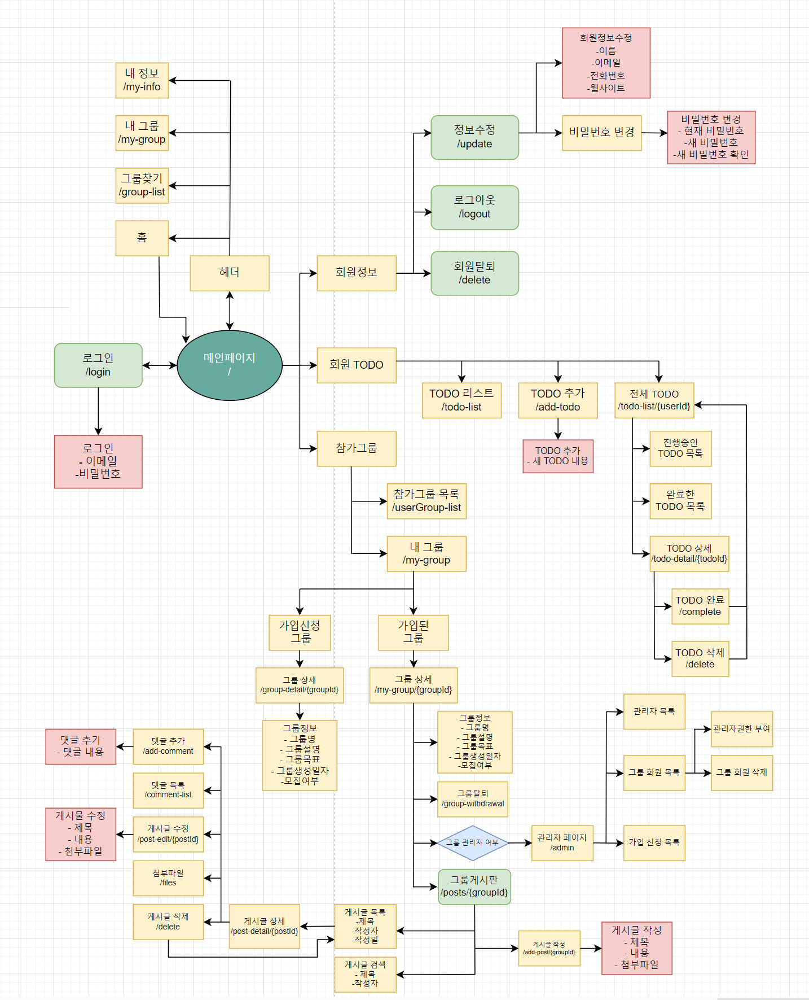

# Springboot 그룹 프로젝트 관리 시스템

## 🖥️ 프로젝트 소개
Springboot 로 제작한 그룹별 프로젝트 관리 시스템 만들기

## 📝 개발 기간
23.12.31 ~ 24.01.23

## ⚙️ 개발 환경
- **Language** : 'Java 17'
- **Farmework** : 'Springboot 3.2.1'
- **Database** : 'H2 database 2.2.224'
- **ORM** : 'MyBatis 3.0.3'
- 'JSP 3.0.1'
- 'lombok'

## 🔍 프로젝트 흐름

## 📌 주요 기능
#### 회원기능
- **회원가입 (/signup)** : 이메일 중복 체크(emailDuplicateCheck), 폼 검증(checkInput())
- **로그인 (/login)** : HttpSession 에 loginId 저장
- **로그아웃 (/logout)** : 세션 invalidate
- **로그인 체크 필터 (LoginCheckFilter)** : 서비스 url 접근시 session 에 저장된 loginId 를 통해 회원 체크
- **회원정보수정 (/update)** : session 에 저장된 loginId 정보를 가져와서 회원정보, 비밀번호 변경 구현

#### 홈 대시보드
- **로그인 회원과 관련된 전반적인 정보 제공** : 회원정보, TODO목록, 참가중인그룹
- **TODO 기능** : jquery/ajax 를 이용해서 홈에서 TODO 추가 및 조회 (todoList(), addTodo())
- **참가 그룹** : jquery/ajax 를 이용해서 홈에서 참가중인 그룹 조회 (groupList())

#### 그룹기능
- **그룹관리** : 관리자 권한을 가지면 독립된 그룹 관리 (그룹 수정, 그룹 회원관리 등)
- **그룹가입** : 새 그룹을 생성하거나 생성된 그룹목록에서 그룹가입 신청, 해당 그룹 관리자가 가입승인 여부 결정

#### 그룹 게시판
- **그룹 게시판** : 각 그룹마다 독립적인 게시판 이용 구현 (게시글 검색, 게시글 작성, 게시글 수정 등)
- **댓글 기능** : 각 게시글마다가 댓글 기능 구현 (commentList(), addComment())
- **파일 기능** : 각 게시글마다 파일 조회, 업로드/다운로드 구현, 업로드된 파일은 DB내 파일 테이블에 저장 (fileList(), getFile(), addFile())

## 👑 목표
- join 을 통해 DB내 데이터를 효율적으로 가져오기
- 각 기능을 최대한 독립적으로 구현
- jquery / ajax 정확히 익히기 
